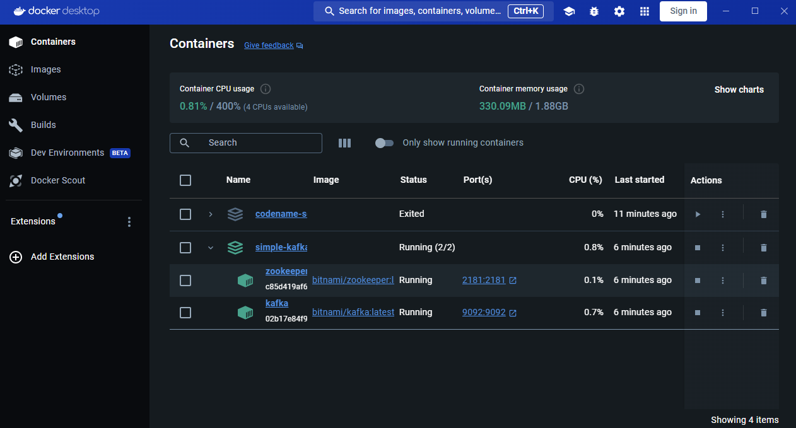

# Studi Kasus Apache Kafka

## Anggota Kelompok
- Awang Fraditya (5027221055)
- Hafiz Akmaldi Santosa (5027221061)

## Topik: Pengumpulan Data Sensor IoT dengan Apache Kafka

### Latar Belakang Masalah:

Sebuah pabrik memiliki beberapa mesin yang dilengkapi sensor suhu. Data suhu dari setiap mesin perlu dipantau secara real-time untuk menghindari overheating. Setiap sensor akan mengirimkan data suhu setiap detik, dan pabrik membutuhkan sistem yang dapat mengumpulkan, menyimpan, dan menganalisis data suhu ini.

### Studi Kasus Sederhana:

- Pabrik membutuhkan aliran data sensor yang dapat diteruskan ke layanan analitik atau dashboard secara langsung.
- Apache Kafka akan digunakan untuk menerima dan mengalirkan data suhu, sementara PySpark akan digunakan untuk mengolah dan memfilter data tersebut.

### Tugas:
1. Buat Topik Kafka untuk Data Suhu:
    - Buat topik di Apache Kafka bernama "sensor-suhu" yang akan menerima data suhu dari sensor-sensor mesin.

2. Simulasikan Data Suhu dengan Producer:
    - Buat producer sederhana yang mensimulasikan data suhu dari beberapa sensor mesin (misalnya, 3 sensor berbeda).
    - Setiap data suhu berisi ID sensor dan suhu saat ini (misalnya, sensor_id: S1, suhu: 70°C), dan dikirim setiap detik ke topik "sensor-suhu".

3. Konsumsi dan Olah Data dengan PySpark:
    - Buat consumer di PySpark yang membaca data dari topik "sensor-suhu".
Filter data suhu yang berada di atas 80°C, sebagai indikator suhu yang perlu diperhatikan.

4. Output dan Analisis:
    - Cetak data yang suhu-nya melebihi 80°C sebagai tanda peringatan sederhana di console.

## 1. Buat Topik "sensor-suhu"
- Pertama kita akan setup kafka untuk dijalankan di docker.
```yaml
services:
  zookeeper:
    image: 'bitnami/zookeeper:latest'
    container_name: zookeeper
    environment:
      - ALLOW_ANONYMOUS_LOGIN=yes
    ports:
      - '2181:2181'

  kafka:
    image: 'bitnami/kafka:latest'
    container_name: kafka
    environment:
      - KAFKA_BROKER_ID=1
      - KAFKA_ZOOKEEPER_CONNECT=zookeeper:2181
      - ALLOW_PLAINTEXT_LISTENER=yes
      - KAFKA_LISTENERS=PLAINTEXT://:9092
      - KAFKA_ADVERTISED_LISTENERS=PLAINTEXT://localhost:9092
    ports:
      - '9092:9092'
    depends_on:
      - zookeeper
```
- Kemudian jalankan.
```bash
docker-compose up -d
```
- Layanan telah berjalan


- Untuk membuat topik, jalankan perintah berikut

```bash
docker exec -it kafka kafka-topics.sh --create --topic sensor-suhu --bootstrap-server localhost:9092 --partitions 1 --replication-factor 1
```
- Berhasil membuat topik "sensor suhu"


## 2. Simulasikan Data Suhu dengan Producer

- Untuk membuat producer dan consumer, kita akan menggunakan kafka-python.


- Berikut adalah kode program kafka python:
```python
import time
import random
from kafka import KafkaProducer
import json

# Koneksi ke Kafka
producer = KafkaProducer(bootstrap_servers='localhost:9092',
                         value_serializer=lambda v: json.dumps(v).encode('utf-8'))

def generate_sensor_data(sensor_id):
    # Mensimulasikan suhu antara 60°C - 100°C sebagai integer
    suhu = random.randint(60, 100)
    return {'sensor_id': sensor_id, 'suhu': suhu}

sensor_ids = ['S1', 'S2', 'S3']  # Tiga sensor

try:
    while True:
        for sensor_id in sensor_ids:
            data = generate_sensor_data(sensor_id)
            producer.send('sensor-suhu', data)
            print(f"Mengirim data: {data['sensor_id']} - {data['suhu']}°C")  # Menampilkan dengan "°C"
        time.sleep(1)
except KeyboardInterrupt:
    producer.close()
    print("Producer stopped.")
```

## 3. Konsumsi dan Olah Data dengan PySpark

- Membuat consumer di PySpark yang membaca data dari topik "sensor-suhu".
Filter data suhu yang berada di atas 80°C, sebagai indikator suhu yang perlu diperhatikan.

```python
from pyspark.sql import SparkSession
from pyspark.sql.functions import from_json, col, concat, lit
from pyspark.sql.types import StructType, StringType, IntegerType

# Membuat sesi Spark dengan konektor Kafka
spark = SparkSession.builder \
    .appName("SensorDataProcessor") \
    .config("spark.jars.packages", "org.apache.spark:spark-sql-kafka-0-10_2.12:3.4.0") \
    .getOrCreate()

# Mengonfigurasi Kafka stream
sensor_data = spark \
    .readStream \
    .format("kafka") \
    .option("kafka.bootstrap.servers", "localhost:9092") \
    .option("subscribe", "sensor-suhu") \
    .load()

# Mendefinisikan skema data suhu
schema = StructType() \
    .add("sensor_id", StringType()) \
    .add("suhu", IntegerType())

# Mengonversi value dari Kafka (format biner) ke JSON
sensor_df = sensor_data \
    .selectExpr("CAST(value AS STRING) as json") \
    .select(from_json(col("json"), schema).alias("data")) \
    .select("data.sensor_id", "data.suhu")

# Membuat kolom baru dengan satuan "°C"
sensor_df_with_unit = sensor_df.withColumn("suhu", concat(col("suhu"), lit("°C")))

# Filter suhu > 80°C
alert_df = sensor_df_with_unit.filter(sensor_df.suhu > 80)

# Menampilkan peringatan dengan suhu dalam "°C"
query = alert_df \
    .select("sensor_id", "suhu") \
    .writeStream \
    .outputMode("append") \
    .format("console") \
    .start()

query.awaitTermination()
```

## 4. Output dan Analisis

- Jalankan program producer dan consumer, kemudian perhatikan pesan yang ditampilkan