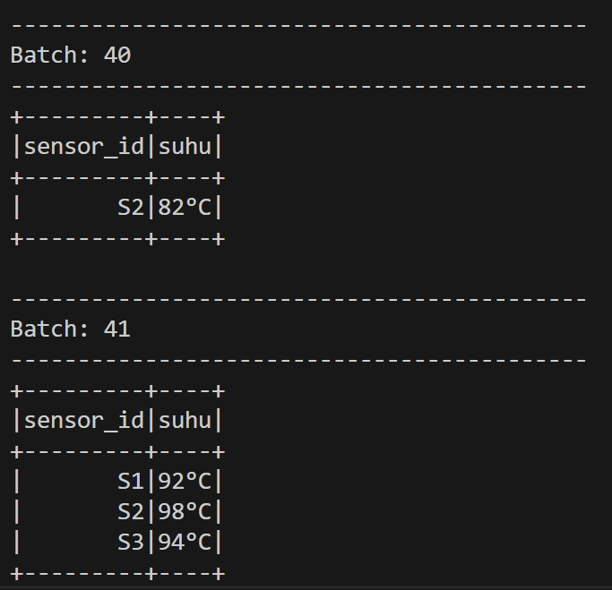

# Studi Kasus Apache Kafka

## Anggota Kelompok
- Awang Fraditya (5027221055)
- Hafiz Akmaldi Santosa (5027221061)

## Topik: Pengumpulan Data Sensor IoT dengan Apache Kafka

### Latar Belakang Masalah:

Sebuah pabrik memiliki beberapa mesin yang dilengkapi sensor suhu. Data suhu dari setiap mesin perlu dipantau secara real-time untuk menghindari overheating. Setiap sensor akan mengirimkan data suhu setiap detik, dan pabrik membutuhkan sistem yang dapat mengumpulkan, menyimpan, dan menganalisis data suhu ini.

### Studi Kasus Sederhana:

- Pabrik membutuhkan aliran data sensor yang dapat diteruskan ke layanan analitik atau dashboard secara langsung.
- Apache Kafka akan digunakan untuk menerima dan mengalirkan data suhu, sementara PySpark akan digunakan untuk mengolah dan memfilter data tersebut.

### Tugas:
1. Buat Topik Kafka untuk Data Suhu:
    - Buat topik di Apache Kafka bernama "sensor-suhu" yang akan menerima data suhu dari sensor-sensor mesin.

2. Simulasikan Data Suhu dengan Producer:
    - Buat producer sederhana yang mensimulasikan data suhu dari beberapa sensor mesin (misalnya, 3 sensor berbeda).
    - Setiap data suhu berisi ID sensor dan suhu saat ini (misalnya, sensor_id: S1, suhu: 70°C), dan dikirim setiap detik ke topik "sensor-suhu".

3. Konsumsi dan Olah Data dengan PySpark:
    - Buat consumer di PySpark yang membaca data dari topik "sensor-suhu".
Filter data suhu yang berada di atas 80°C, sebagai indikator suhu yang perlu diperhatikan.

4. Output dan Analisis:
    - Cetak data yang suhu-nya melebihi 80°C sebagai tanda peringatan sederhana di console.

## Requirements
- Docker
- Java 21 / OpenJDK-21
- Python 3.12 (cofluent-kafka, pyspark)

## 1. Buat Topik "sensor-suhu"
- Pertama kita akan setup kafka untuk dijalankan di docker.
```yaml
version: '3'

services:
  zookeeper:
    image: wurstmeister/zookeeper:latest
    ports:
      - "2181:2181"

  kafka:
    image: wurstmeister/kafka:latest
    ports:
      - "9092:9092"
    expose:
      - "9093"
    environment:
      KAFKA_ADVERTISED_LISTENERS: INSIDE://kafka:9093,OUTSIDE://localhost:9092
      KAFKA_LISTENER_SECURITY_PROTOCOL_MAP: INSIDE:PLAINTEXT,OUTSIDE:PLAINTEXT
      KAFKA_LISTENERS: INSIDE://0.0.0.0:9093,OUTSIDE://0.0.0.0:9092
      KAFKA_INTER_BROKER_LISTENER_NAME: INSIDE
      KAFKA_ZOOKEEPER_CONNECT: zookeeper:2181
      KAFKA_CREATE_TOPICS: "my-topic:1:1"
    volumes:
      - /var/run/docker.sock:/var/run/docker.sock
```
- Kemudian jalankan.
```bash
docker-compose up -d
```
- Layanan telah berjalan


- Untuk membuat topik, jalankan perintah berikut

```bash
kafka docker exec -it <kafka-container-id> /opt/kafka/bin/kafka-topics.sh --create --zookeeper zookeeper:2181 --replication-factor 1 --partitions 1 --topic sensor-suhu
```
- Berhasil membuat topik "sensor-suhu"


## 2. Simulasikan Data Suhu dengan Producer

- Untuk membuat producer dan consumer, kita akan menggunakan cofluent-kafka.

- Berikut adalah kode program kafka python:
```python
from confluent_kafka import Producer
import json
import time
import random

# Producer
conf = {'bootstrap.servers': 'localhost:9092'}
producer = Producer(conf)

# Random Temoerature Data Gen
def generate_sensor_data(sensor_id):
    suhu = random.randint(60, 100)
    return {'sensor_id': sensor_id, 'suhu': suhu}

# Sensor IDs
sensor_ids = ['S1', 'S2', 'S3']

# Infinite Loop & Stream Data
try:
    while True:
        for sensor_id in sensor_ids:
            data = generate_sensor_data(sensor_id)
            producer.produce('sensor-suhu', 
                           value=json.dumps(data).encode('utf-8'))
            print(f"Mengirim data: {data['sensor_id']} - {data['suhu']}°C")
        producer.flush()
        time.sleep(1)
except KeyboardInterrupt:
    producer.close()
    print("Producer stopped.")
```

## 3. Konsumsi dan Olah Data dengan PySpark

- Membuat consumer di PySpark yang membaca data dari topik "sensor-suhu".
Filter data suhu yang berada di atas 80°C, sebagai indikator suhu yang perlu diperhatikan.

```python
from pyspark.sql import SparkSession
from pyspark.sql.functions import from_json, col, concat, lit
from pyspark.sql.types import StructType, StringType, IntegerType

# Spark Session: Connect to Kafka
spark = SparkSession.builder \
    .appName("SensorDataProcessor") \
    .config("spark.jars.packages", "org.apache.spark:spark-sql-kafka-0-10_2.12:3.4.0") \
    .getOrCreate()

# Kafka Stream
sensor_data = spark \
    .readStream \
    .format("kafka") \
    .option("kafka.bootstrap.servers", "localhost:9092") \
    .option("subscribe", "sensor-suhu") \
    .load()

# Schema
schema = StructType() \
    .add("sensor_id", StringType()) \
    .add("suhu", IntegerType())

# Cast data to JSON
sensor_df = sensor_data \
    .selectExpr("CAST(value AS STRING) as json") \
    .select(from_json(col("json"), schema).alias("data")) \
    .select("data.sensor_id", "data.suhu")

# Temperature Col "°C"
sensor_df_with_unit = sensor_df.withColumn("suhu", concat(col("suhu"), lit("°C")))

# Temperature Filter (Temperature > 80°C)
alert_df = sensor_df_with_unit.filter(sensor_df.suhu > 80)

# Alert
query = alert_df \
    .select("sensor_id", "suhu") \
    .writeStream \
    .outputMode("append") \
    .format("console") \
    .start()

query.awaitTermination()
```

## 4. Output dan Analisis

- Jalankan program producer dan consumer, kemudian perhatikan pesan yang ditampilkan

### Producer


### Consumer
